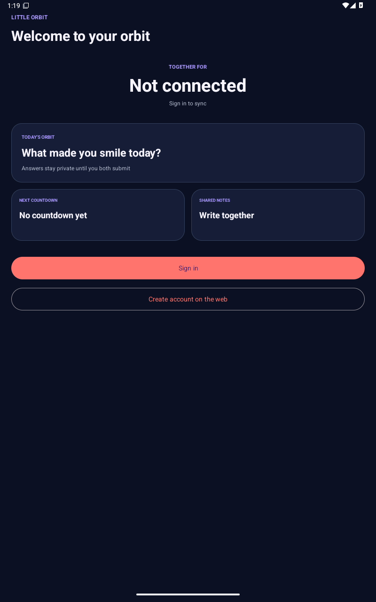

# Little Orbit showcase

These concepts define the 1.0 visual target. Product screenshots will replace or sit beside them as screens become release-ready.

## Identity

The two linked orbits communicate two independent people choosing a shared path. Deep navy provides a calm base, coral marks warmth and action, and soft lavender supports quieter surfaces.

## Android, widget, and Wear OS

The dashboard leads with the relationship rather than system controls. Daily questions, countdowns, and notes use spacious cards. Widgets and watch surfaces show cached together-time and the next countdown, with a visible stale marker when refresh is overdue.

### Current Android implementation

The emulator capture verifies the adaptive dark theme, landscape reflow, scrollable feature navigation, signed-out state, and accessible native controls. Portrait, large-text, widget, and Wear OS captures remain part of the physical-device release gate.

## Public website

The website explains the mission, provides the signed APK and checksum, and hosts account and project pages. Relationship features remain in the Android app.

### Current implementation

Regenerate these images from the running gateway with `npm --prefix apps/web run capture:showcase`. The capture command fails on HTTP or browser-console errors.

## Owner console

The console exposes service health, delivery and generation status, moderation queues, and account metadata. It deliberately has no viewer for notes, answers, precise locations, or exports.

## Screenshot checklist

- [ ] Real phone: signed-out, pairing, daily question, both-answered reveal, countdown, notes conflict, together-time, privacy controls.
- [x] API 36 emulator: debug APK install, launch, signed-out dashboard hierarchy, landscape rendering, and runtime-crash check.
- [ ] Home widget: fresh, stale, signed-out, and server-offline states.
- [ ] Wear OS: tile, complication, loading, stale, and disconnected states.
- [x] Website baseline: desktop landing, mobile landing, signup, and owner login.
- [ ] Website remaining: recovery states, expanded mobile navigation, and dedicated accessibility views.
- [ ] Owner console: TOTP enrollment, health, AI batch review, user metadata, and redacted configuration.
- [ ] Two-device flow: pairing through unpair archive on physical phones.
