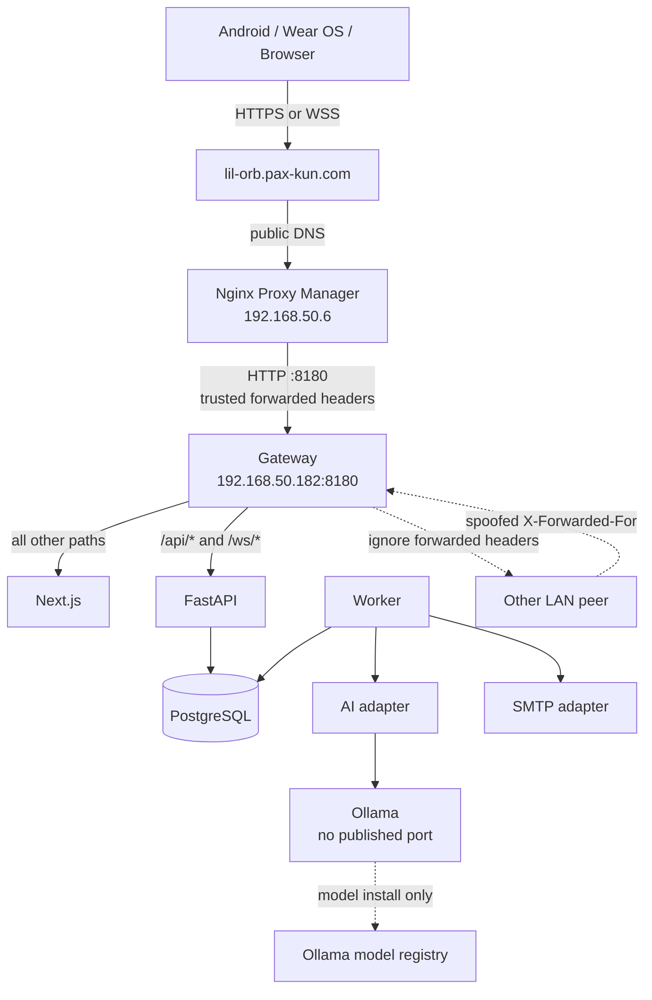
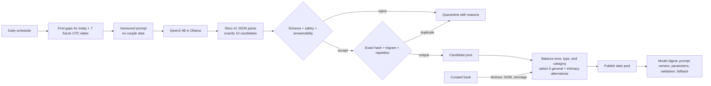
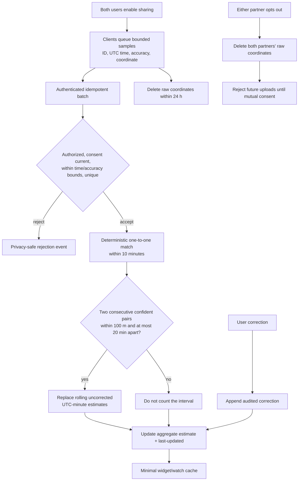
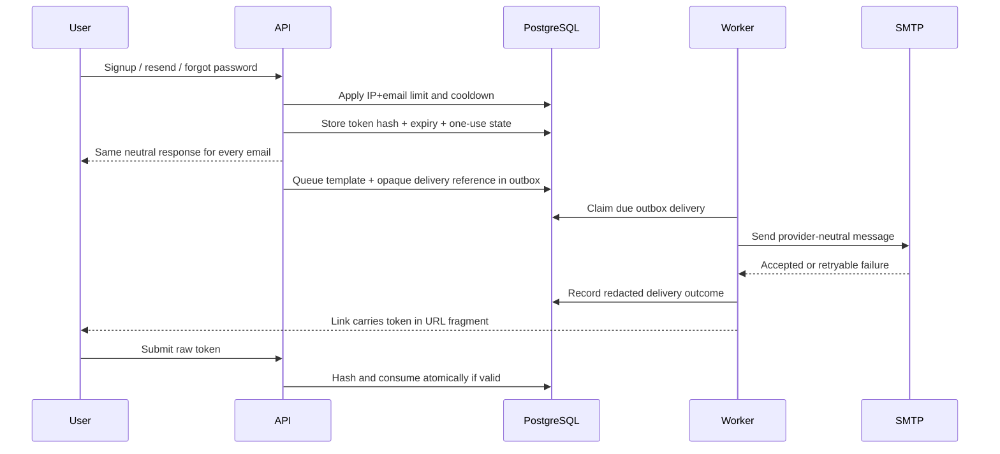
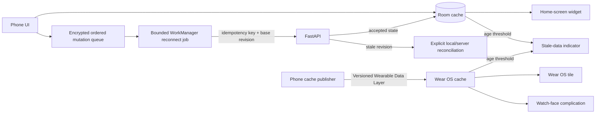
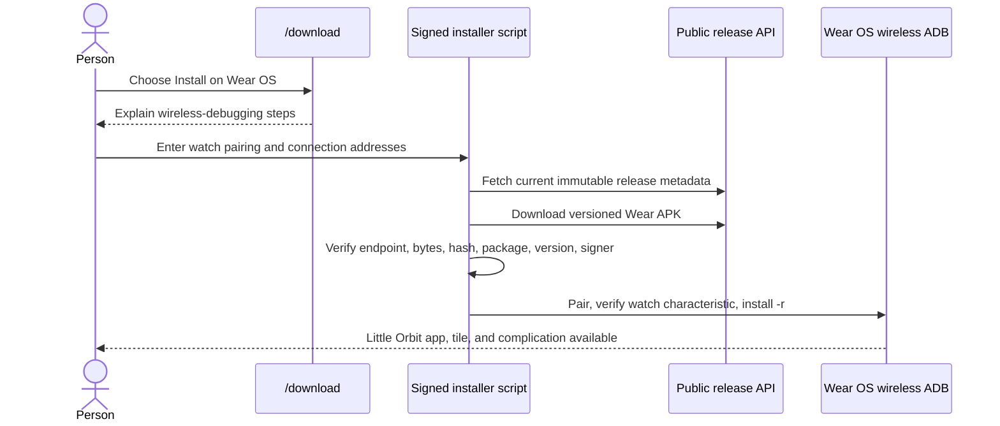
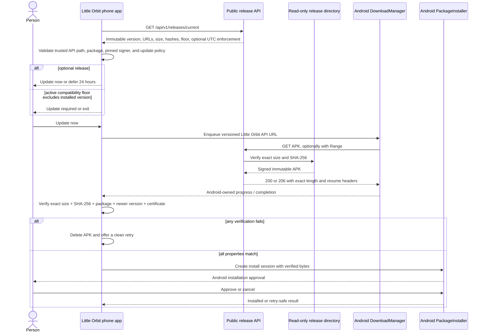
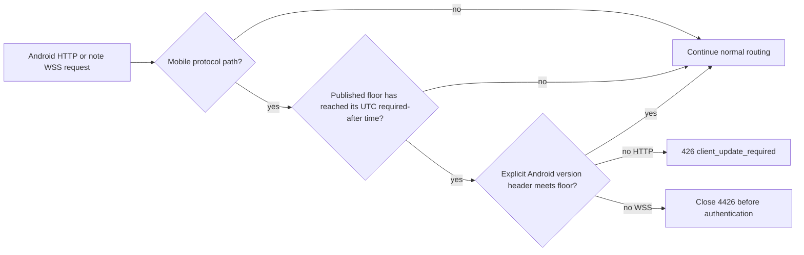

# Network and logic flows

The Mermaid diagrams in this document are the editable architecture source of truth. The overview PNG is a reader-friendly concept and must be regenerated when its flow changes.


## External routing and trust



Only gateway port 8180 is published by Compose. Windows Firewall allows that production port only from `192.168.50.6`. The address `192.168.50.182` needs a DHCP reservation before production use.

Caddy trusts incoming `X-Forwarded-For` only when its immediate peer is `192.168.50.6`. It overwrites a private `X-Little-Orbit-Client-IP` header before proxying to FastAPI. FastAPI validates that value as one IP address and does not enable Uvicorn's generic proxy-header trust.

## Authentication and pairing

```mermaid
sequenceDiagram
    actor A as Creator
    actor B as Partner
    participant API
    participant DB as PostgreSQL
    A->>API: Register + 18+/terms + honeypot
    API->>DB: Store Argon2id hash + hashed verification token
    API-->>A: Neutral response; email verification link
    A->>API: Consume verification token once
    A->>API: Create pair code
    API->>DB: Store hashed 8-char code, expires +10m
    B->>API: Redeem code
    API->>DB: Lock code; verify B and capacity; mark pending
    API-->>A: Ask creator to confirm B
    A->>API: Confirm pending partner
    API->>DB: One transaction: consume code + create two-member couple
    API-->>A: Return shared paired state
    API-->>B: Pairing becomes visible on the next authenticated refresh
```

Public registration, resend, and recovery responses are identical for known and unknown emails. Rate limits apply to IP and normalized email keys.

## Live notes

```mermaid
sequenceDiagram
    participant A as Partner A
    participant API
    participant DB as PostgreSQL
    participant B as Partner B
    A->>API: WSS authenticate + subscribe(note_id)
    API->>DB: Authorize actor before note lookup
    API-->>A: Snapshot(revision N)
    A->>API: Operation(op_id, base N, insert/delete)
    API->>DB: Lock note; dedupe op_id; transform; append revision N+1
    API-->>A: Ack(op_id, revision N+1)
    API-->>B: Applied operation(revision N+1)
    Note over A,B: Out-of-order or duplicate operations are idempotent
    A--xAPI: Disconnect
    Note over A: Preserve draft and base revision
    A->>API: Reconnect with base revision
    API-->>A: Operations or conflict snapshot
    Note over A: If revisions diverge beyond safe transform, show both versions
```

## Daily AI generation



Invalid model output is quarantined rather than repaired. A 180-question curated bank guarantees five general questions plus a consent-gated intimacy alternative for today and seven future dates while the model is unavailable.

## Daily quiz, custom queue, and reveal

```mermaid
sequenceDiagram
    actor A as Partner A
    actor B as Partner B
    participant API
    participant DB as PostgreSQL
    A->>API: GET today's UTC quiz
    API->>DB: Lock couple; snapshot 5 questions once
    Note over DB: Due custom FIFO slots first,<br/>then eligible global questions
    API-->>A: Stable ordered set; no partner answers
    A->>API: PUT private draft(op_id, answer revision)
    API->>DB: Authorize, dedupe op_id, validate type, increment revision
    A->>API: POST finish(day revision)
    API->>DB: Mark A finished; keep reveal closed
    B->>API: Save all five drafts + finish
    API->>DB: Lock both member rows; set one revealed_at timestamp
    API-->>B: Both complete; include both answer sets
    A->>API: Poll content-free status through WorkManager
    API-->>A: revealed=true; no answer content in notification response
    A->>API: GET day
    API-->>A: Side-by-side shared reveal
```

A person may reopen and edit a finished set only before the shared reveal. Past incomplete days remain editable for seven days and remain visible for 30. Custom questions take the next available UTC slot, up to all five questions, and surprise content is hidden from the other partner until its day arrives. Non-surprise custom questions appear in both partners' pending queue. Intimacy-tagged custom or global questions require both partners' current consent. If either person opts out, every unrevealed intimacy prompt is replaced atomically, its drafts are cleared, and both people review the safe replacement before finishing again.

## Relationship start-date agreement

```mermaid
sequenceDiagram
    actor A as Proposer
    actor B as Partner
    participant API
    participant DB as PostgreSQL
    A->>API: Propose date + operation ID
    API->>DB: Authorize member; lock couple and pending proposal
    API->>DB: Replace A's earlier proposal; expire after 7 days
    API-->>A: Pending proposal
    B->>API: Accept or decline + operation ID
    API->>DB: Authorize member; lock current proposal
    alt accepted and still current
        API->>DB: Store shared start date atomically
        API-->>A: Relationship age updates on refresh
        API-->>B: Relationship age updates on refresh
    else stale, expired, reused, or wrong role
        API-->>B: 409; refresh current state
    end
```

Only the proposer may cancel. Only the other partner may accept or decline. Operation IDs return the original response after a safe retry, and the database permits only one pending proposal per couple.

## Together-time processing



## Email delivery



Email and recovery tokens use URL fragments so browsers do not send them in HTTP request targets or proxy logs. The client submits the token explicitly to the API, where it is hashed and consumed once. Existing query-string links remain accepted during the transition. Local development uses Mailpit. Production uses configured SMTP and never exposes Mailpit publicly. The worker polls the outbox every 30 seconds by default.

## Android offline and wearable cache



Tokens stay in Android Keystore-backed storage. The offline queue contains encrypted countdown mutations. Widget and watch caches contain only the accepted relationship start date, coordinate-free nearby seconds and process time, next countdown, and cache-sync time. RC6 publishes the v2 cache plus the legacy v1 path for one release so an older watch fails stale rather than displaying a new value with the wrong meaning.

## Self-hosted Wear installation



The phone checks connected nodes and the `little_orbit_display_v2` capability so More can distinguish no watch, a missing watch app, and a connected Little Orbit watch. Platform security prevents the phone app from silently sideloading a self-hosted APK.

## Verified Android phone updates



The daily worker fetches metadata only. It cannot download or install an APK. Updater state contains a release ID, phase, byte counts, required flag, and sanitized failure code; it contains no credentials or relationship data. Published release records cannot be edited or unpublished.



The compatibility gate runs before authentication and protected resource lookup, so its response cannot disclose account or relationship state. Routine publications leave `required_after` empty and remain optional.
