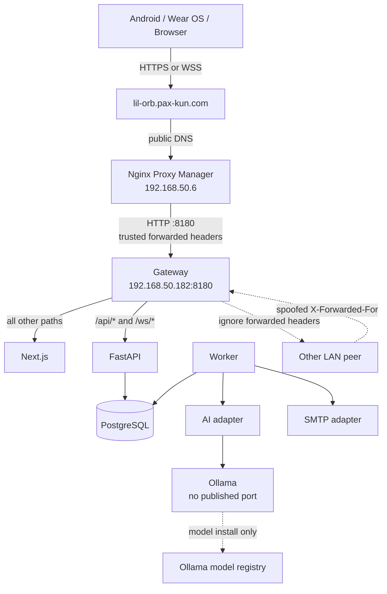
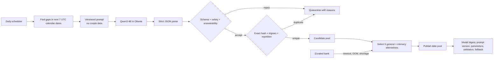
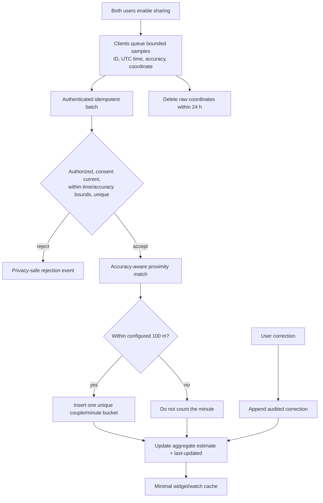
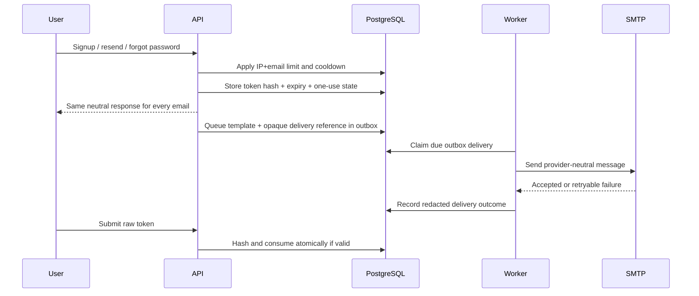
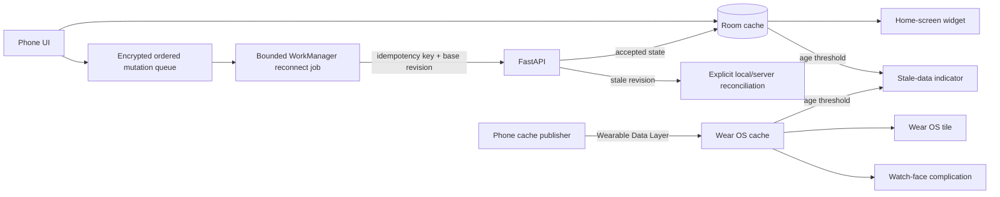

# Network and logic flows

The Mermaid diagrams in this document are the editable architecture source of truth. The overview PNG is a reader-friendly concept and must be regenerated when its flow changes.


## External routing and trust



Only gateway port 8180 is published by Compose. Windows Firewall allows that production port only from `192.168.50.6`. The address `192.168.50.182` needs a DHCP reservation before production use.

Caddy trusts incoming `X-Forwarded-For` only when its immediate peer is `192.168.50.6`. It overwrites a private `X-Little-Orbit-Client-IP` header before proxying to FastAPI. FastAPI validates that value as one IP address and does not enable Uvicorn's generic proxy-header trust.

## Authentication and pairing

```mermaid
sequenceDiagram
    actor A as Creator
    actor B as Partner
    participant API
    participant DB as PostgreSQL
    A->>API: Register + 18+/terms + honeypot
    API->>DB: Store Argon2id hash + hashed verification token
    API-->>A: Neutral response; email verification link
    A->>API: Consume verification token once
    A->>API: Create pair code
    API->>DB: Store hashed 8-char code, expires +10m
    B->>API: Redeem code
    API->>DB: Lock code; verify B and capacity; mark pending
    API-->>A: Ask creator to confirm B
    A->>API: Confirm pending partner
    API->>DB: One transaction: consume code + create two-member couple
    API-->>A: Return shared paired state
    API-->>B: Pairing becomes visible on the next authenticated refresh
```

Public registration, resend, and recovery responses are identical for known and unknown emails. Rate limits apply to IP and normalized email keys.

## Live notes

```mermaid
sequenceDiagram
    participant A as Partner A
    participant API
    participant DB as PostgreSQL
    participant B as Partner B
    A->>API: WSS authenticate + subscribe(note_id)
    API->>DB: Authorize actor before note lookup
    API-->>A: Snapshot(revision N)
    A->>API: Operation(op_id, base N, insert/delete)
    API->>DB: Lock note; dedupe op_id; transform; append revision N+1
    API-->>A: Ack(op_id, revision N+1)
    API-->>B: Applied operation(revision N+1)
    Note over A,B: Out-of-order or duplicate operations are idempotent
    A--xAPI: Disconnect
    Note over A: Preserve draft and base revision
    A->>API: Reconnect with base revision
    API-->>A: Operations or conflict snapshot
    Note over A: If revisions diverge beyond safe transform, show both versions
```

## Daily AI generation



Invalid model output is quarantined rather than repaired. Curated fallback guarantees five general questions for each of the next seven dates.

## Together-time processing



## Email delivery



Local development uses Mailpit. Production uses configured SMTP and never exposes Mailpit publicly.

## Android offline and wearable cache



Tokens stay in Android Keystore-backed storage. The offline queue contains encrypted countdown mutations, while widgets and watch surfaces receive only the minimal cached together-time and next-countdown values they render.
