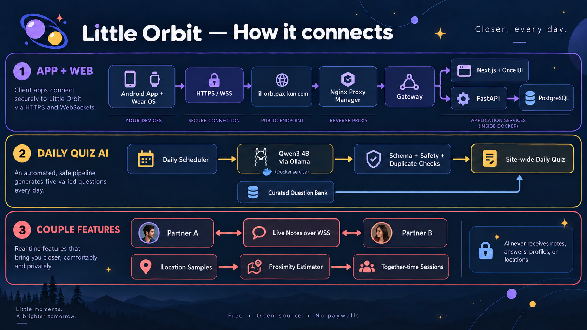
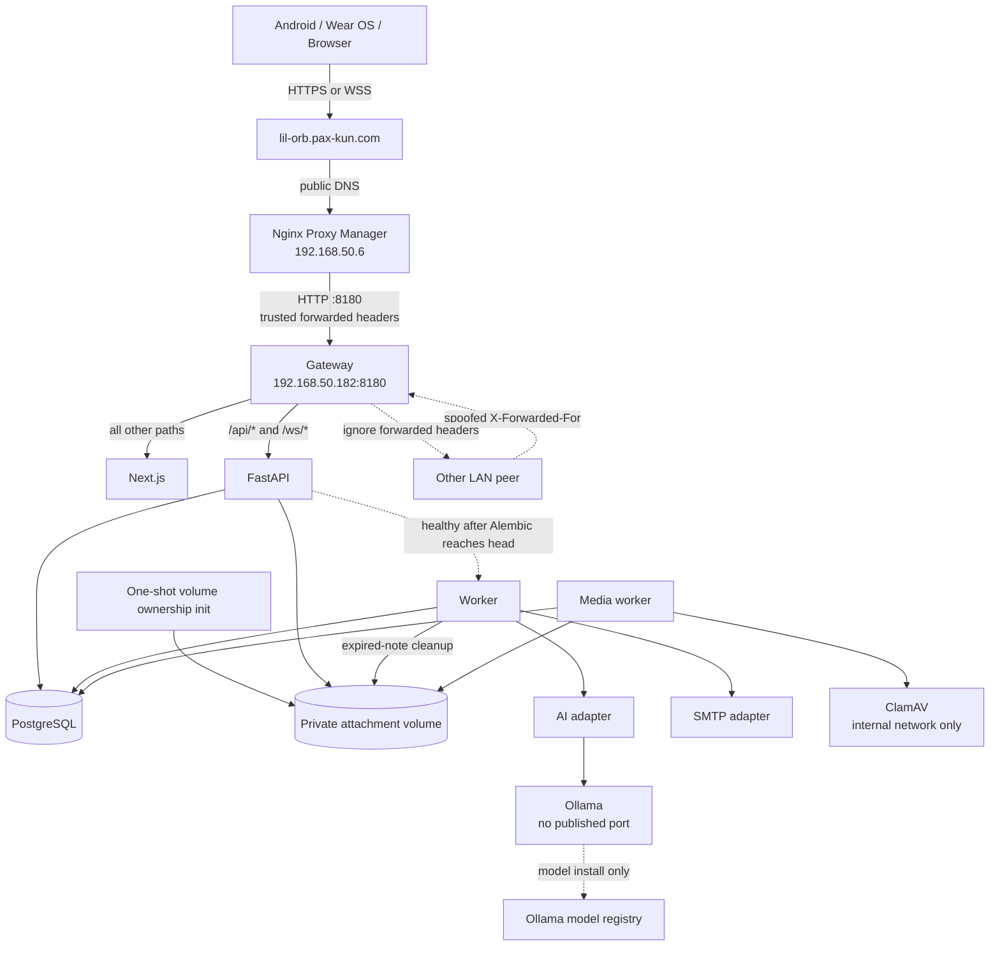
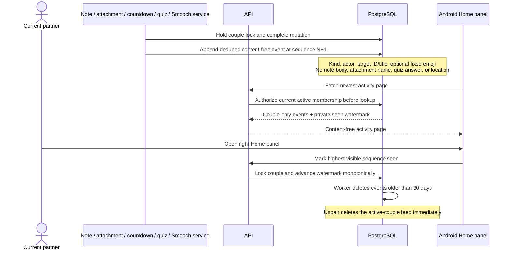
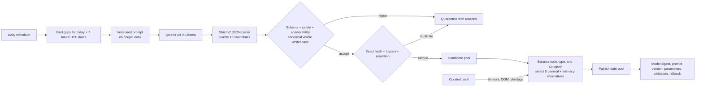
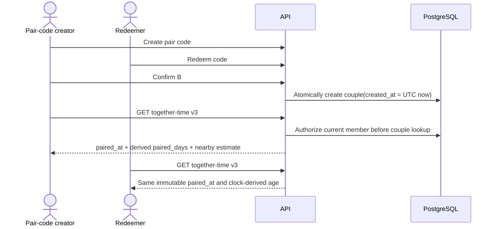
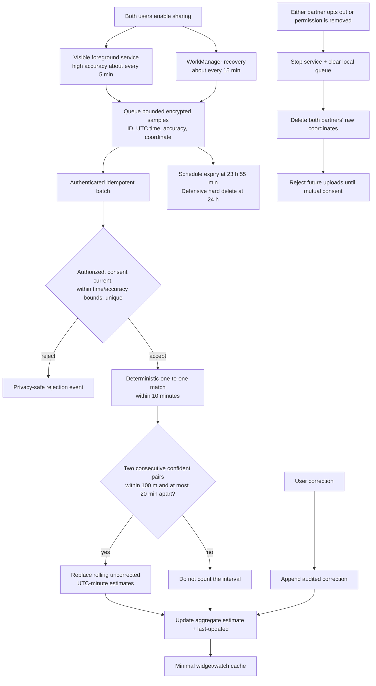
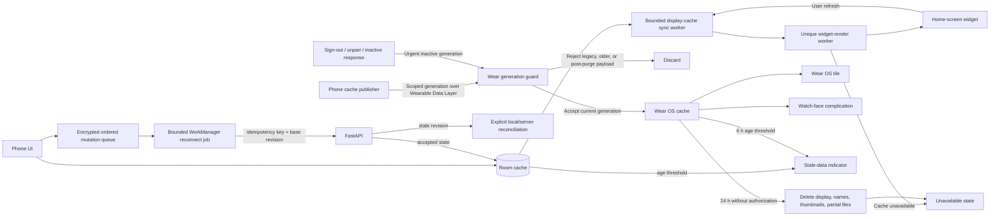
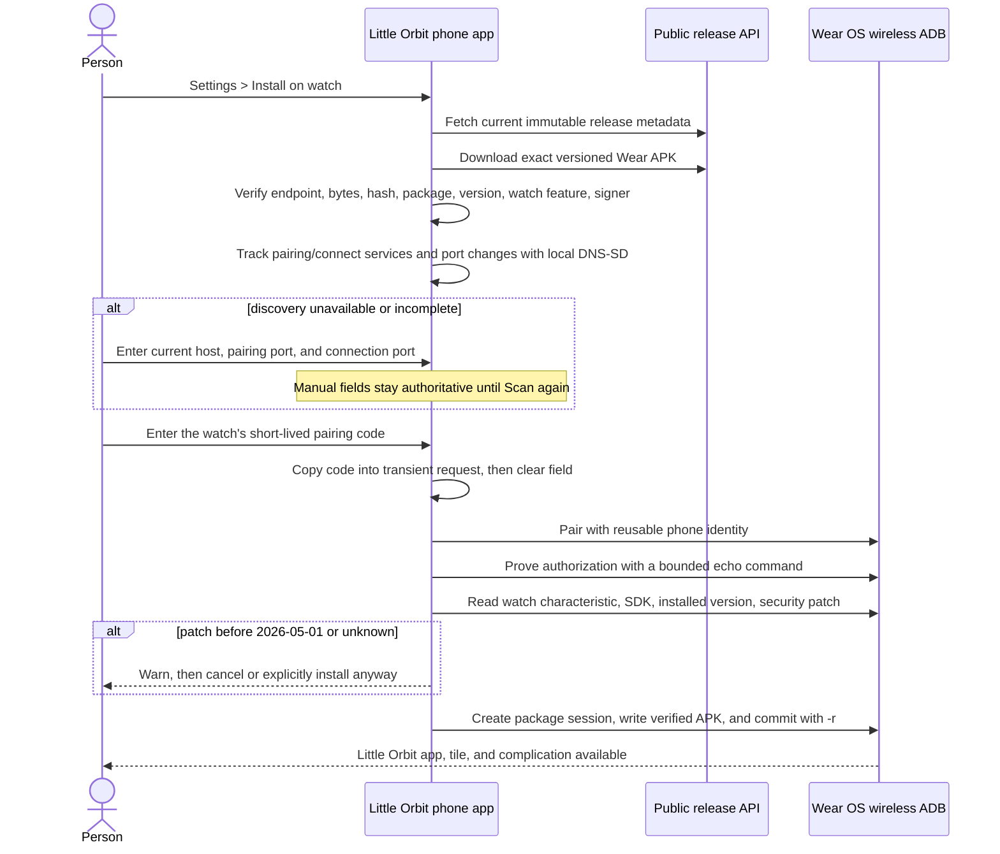
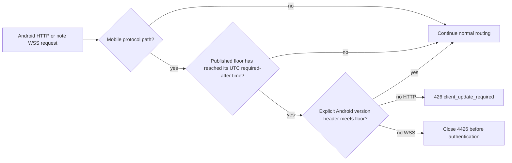

# Network and logic flows

The Mermaid diagrams in this document are the editable architecture source of truth. The overview PNG is a reader-friendly concept and must be regenerated when its flow changes.



## External routing and trust



Only gateway port 8180 is published by Compose. Windows Firewall allows that production port only from `192.168.50.6`. The address `192.168.50.182` needs a DHCP reservation before production use. The worker waits for API health so migrations finish before maintenance or scheduled generation can query the new schema.

Caddy trusts incoming `X-Forwarded-For` only when its immediate peer is `192.168.50.6`. It overwrites a private `X-Little-Orbit-Client-IP` header before proxying to FastAPI. FastAPI accepts that private header only from Caddy's fixed `gateway-api` address, validates it as exactly one IP address, and does not enable Uvicorn's generic proxy-header trust. Compose reserves `172.30.14.2` for Caddy and `172.30.14.3` for FastAPI so update-time start order cannot give the trusted proxy address to the application container. Direct or malformed values fall back to the socket peer for throttling.

## Authentication and pairing

```mermaid
sequenceDiagram
    actor A as Creator
    actor B as Partner
    participant API
    participant DB as PostgreSQL
    A->>API: Register + 18+/terms + honeypot
    API->>DB: Commit capped IP + email digest counters
    API->>DB: Store Argon2id hash + hashed verification token
    API-->>A: Neutral response; email verification link
    A->>API: Consume verification token once
    A->>API: Create pair code
    API->>DB: Store hashed 8-char code, expires +10m
    B->>API: Redeem code
    API->>DB: Commit capped IP + account digest counters
    API->>DB: Lock both accounts, then code; recheck eligibility and capacity
    API-->>A: Ask creator to confirm B
    A->>API: Confirm pending partner
    API->>DB: Re-lock accounts in UUID order; recheck expiry and eligibility
    API->>DB: One transaction: consume code + create two-member couple
    API-->>A: Return shared paired state
    API-->>B: Pairing becomes visible on the next authenticated refresh
```

Public registration, resend, and recovery responses are identical for known and unknown emails. Login, resend, recovery, reset, pair redemption, and administrator proof limits use capped PostgreSQL counters. The service commits these attempts independently, persists only scope-separated keyed hashes, applies the IP bucket before an attacker-controlled subject, and removes inactive rows within 24 hours plus the worker interval.

Password reset locks the account and all outstanding reset tokens, consumes every link, changes the password, and revokes all sessions in one transaction. Login, rotation, administrator issuance, revocation, unpairing, and deletion share the account row as their outer serialization boundary so a stale credential cannot create a surviving session after reset.

## Administrator MFA replacement

```mermaid
sequenceDiagram
    actor Admin
    participant API
    participant DB as PostgreSQL
    Admin->>API: Start replacement with password + current TOTP/recovery
    API->>DB: Commit capped IP + administrator digest counters
    API->>DB: Lock account and MFA; recheck exact live session + current proof
    API->>DB: Store encrypted pending secret with bounded expiry
    Note over DB: Current factor remains active
    API-->>Admin: Authenticator enrollment URI
    Admin->>API: Confirm one code from pending factor
    API->>DB: Recheck account, session, pending expiry, and TOTP replay counter
    API->>DB: Swap factor + hash new recovery codes + revoke every prior session
    API-->>Admin: One new MFA session + recovery codes shown once
    Admin->>API: Read operational configuration
    API-->>Admin: Explicit safe allowlist only
```

## Live notes

```mermaid
sequenceDiagram
    participant A as Partner A
    participant API
    participant DB as PostgreSQL
    participant B as Partner B
    B->>API: GET authorized note directory while library is foreground
    API->>DB: Authorize current couple before listing notes
    API-->>B: Ordered directory snapshot
    A->>API: POST document(operation_id, title, body)
    API->>DB: Insert once + enqueue bounded note alert atomically
    API-->>B: notification.available (content-free)
    loop Every 5 s while B's library remains visible
        B->>API: Refresh authorized directory
        API-->>B: Changed snapshot or identical snapshot
    end
    A->>API: Open one WSS editor session(note_id)
    API->>DB: Authorize actor before note lookup
    API->>DB: After hub registration, recheck exact session + account + note access
    API-->>A: Snapshot(revision N) + unique-account presence
    A->>API: Operation(op_id, base N, insert/delete)
    API->>DB: Lock account + exact session, then couple + note
    API->>DB: Dedupe op_id; transform; append revision N+1
    API-->>A: Ack(op_id, current body, revision N+1)
    API-->>B: Applied operation(revision N+1)
    Note over A,B: Body input debounces 750 ms;<br/>ack patches preserve cursor/selection;<br/>duplicate operation IDs return current state
    A--xAPI: Disconnect
    Note over A: Preserve draft and base revision
    A->>API: Reconnect with base revision
    API-->>A: Operations or conflict snapshot
    Note over A: If revisions diverge beyond safe transform, show both versions
    A->>API: Rename or archive with metadata operation ID
    API->>DB: Lock couple + note; dedupe; increment metadata revision
    Note over DB: Archived notes reject body operations<br/>and remain restorable for 7 days
    loop Every operation or 30 s idle heartbeat
        API->>DB: Recheck session, account, and current note access
        DB-->>API: Active or terminal revocation
    end
```

Session expiry, revocation, suspension, deletion, unpairing, or note archival closes the socket. The server retains only the keyed session digest needed for revalidation; the raw bearer token is not kept in connection state. Android does not rebuild the library for an identical snapshot, and leaving the library stops its directory refresh.

## Private note attachments

```mermaid
sequenceDiagram
    actor A as Current partner
    participant API
    participant DB as PostgreSQL
    participant Files as Private volume
    participant Media as Media worker
    participant AV as ClamAV
    A->>API: Reserve(note_id, op_id, name, type, bytes, SHA-256)
    API->>DB: Authorize before note lookup; lock couple; reserve quota
    API-->>A: Stable attachment ID + exact upload offset
    loop Bounded 1 MiB client chunks
        A->>API: PUT bytes with Upload-Offset
        API->>Files: Append at locked offset
        API-->>A: Current offset and state
    end
    API->>DB: Mark pending_scan only after original SHA-256 matches
    Media->>Files: Stream staged file
    Media->>AV: INSTREAM scan on isolated network
    AV-->>Media: Clean, found, or unavailable
    alt clean and sanitization succeeds
        Media->>Files: Write metadata-free type-specific copy
        Media->>DB: Re-lock couple; recheck final size/quota; mark available
        Media->>DB: Append content-free attachment-ready activity
        A->>API: GET sanitized content
        API->>DB: Reauthorize current couple and note
        API-->>A: Private no-store bytes + exact digest
    else scanner unavailable
        Media->>DB: Return to pending_scan for bounded retry
    else unsafe or invalid
        Media->>DB: Mark rejected with content-free reason
        Media->>Files: Delete staged and output bytes
    end
```

The API accepts only the allow-listed media types, at most 100 MiB per file and 2 GiB per current couple. Request streams are bounded before buffering, operation-ID replays must describe the same bytes, and neither staging nor ClamAV has a published port. The media worker permits bounded sanitizer growth, then rechecks the final 100 MiB limit and couple quota while holding the couple lock. Android inserts an `attachment://` reference only after availability and verifies the sanitized hash before preview or **Keep offline**. Deletion removes server bytes immediately; note expiry removes remaining volume objects after the database transaction.

## Private couple activity



The timeline helps each partner notice shared changes without creating another copy of private content. Event insertion shares the mutation's couple lock, dedupe keys make retries harmless, and sequence and seen watermarks only move forward. Administrators have no feed viewer.

## Daily AI generation



Invalid model output is quarantined rather than repaired. Tabs, line breaks, control characters, non-breaking spaces, repeated horizontal spaces, and leading or trailing whitespace are rejected before publication so hidden layout characters never reach Android. A 180-question curated bank guarantees five general questions plus a consent-gated intimacy alternative for today and seven future dates while the model is unavailable.

## Daily quiz, custom queue, and reveal

```mermaid
sequenceDiagram
    actor A as Partner A
    actor B as Partner B
    participant API
    participant DB as PostgreSQL
    A->>API: GET today's UTC quiz
    API->>DB: Lock couple; snapshot 5 questions once
    Note over DB: Due custom FIFO slots first,<br/>then eligible global questions
    API-->>A: Stable ordered set; no partner answers
    A->>API: PUT private draft(op_id, answer revision)
    API->>DB: Authorize, dedupe op_id, validate type, increment revision
    A->>API: POST finish(day revision)
    API->>DB: Mark A finished + enqueue partner-finished event
    B->>API: Save all five drafts + finish
    API->>DB: Lock both member rows; set one revealed_at + enqueue results-ready events
    API-->>B: Both complete; include both answer sets
    A->>API: Fetch pending events for random installation ID
    API-->>A: results-ready with UTC date only
    A->>API: GET day
    API-->>A: Side-by-side shared reveal
```

A person may reopen and edit a finished set only before the shared reveal. Past incomplete days remain editable for seven days and remain visible for 30. Custom questions take the next available UTC slot, up to all five questions, and surprise content is hidden from the other partner until its day arrives. Non-surprise custom questions appear in both partners' pending queue. Intimacy-tagged custom or global questions require both partners' current consent. If either person opts out, every unrevealed intimacy prompt is replaced atomically, its drafts are cleared, and both people review the safe replacement before finishing again.

## Calendar-aware countdowns and private reminders

```mermaid
sequenceDiagram
    actor A as Partner A
    actor B as Partner B
    participant PhoneA as Android A
    participant API
    participant DB as PostgreSQL
    participant Calendar as Selected calendar app
    A->>PhoneA: Pick timed instant or all-day local date
    PhoneA->>API: Mutation(op_id, revision, timezone, timing kind)
    API->>DB: Authorize; lock couple; validate; dedupe; save
    API->>DB: Enqueue countdown-created/rescheduled event for B
    A->>API: Replace my reminder offsets
    API->>DB: Store only A's fixed offset choices
    API-->>PhoneA: Countdown plus A's private reminders
    PhoneA->>PhoneA: Schedule local alerts; all-day uses 09:00 event time
    B->>API: GET countdowns
    API-->>B: Shared details plus only B's reminder choices
    A->>PhoneA: Add to calendar
    PhoneA->>Calendar: Prefilled user-approved insert intent
    Note over PhoneA,Calendar: One-way copy; no calendar token or later sync
```

Reboot, app replacement, clock change, timezone change, and successful countdown sync all trigger reminder reconciliation. Offline countdown mutations keep their operation IDs and existing reminder selection until the server accepts the change.

## Pairing-based relationship age



The confirmed pair transaction supplies the only 1.0 relationship-age origin. Android, widget, tile, and complication derive age from that instant and no longer ask either partner to choose a date. Older date-proposal endpoints remain temporarily available for protocol compatibility but RC10 clients do not render or mutate them.

## Together-time processing



Collection may continue into the encrypted local queue while the network is offline. Upload and server processing resume later, except that a sample already inside the five-minute cleanup margin is rejected instead of being reintroduced near its hard retention ceiling. Two consecutive confident nearby pairs are still required; continuous collection improves the chance of collecting evidence without converting sparse or distant samples into false together-time.

## Smooch delivery and weekly history

```mermaid
sequenceDiagram
    actor A as Sender
    participant PhoneA as Sender phone
    participant API
    participant DB as PostgreSQL
    participant PhoneB as Partner phone
    actor B as Recipient
    A->>PhoneA: Choose one of 9 emoji
    PhoneA->>PhoneA: Queue encrypted send, max 5 / 15 min
    PhoneA->>API: POST emoji + phrase key + operation ID
    API->>DB: Authorize and lock current couple
    API->>DB: Enforce 5 sends in rolling hour; insert once
    API-->>PhoneA: Accepted event + remaining allowance
    API->>DB: Insert short-lived notification event in same transaction
    API-->>PhoneB: Content-free WSS hint while app is foreground
    PhoneB->>API: Fetch pending events for random installation ID
    API-->>PhoneB: Recipient-only authorized event metadata
    PhoneB-->>B: Private notification; generic public lock-screen version
    PhoneB->>API: Acknowledge this installation after Android posts it
    B->>API: GET Monday-Sunday weekly history
    API->>DB: Apply couple home timezone; aggregate both directions
    API-->>B: Current and historical weekly totals
```

Smooch rows survive unpairing in each original participant's private archive and never appear to a later partner. Deleting either participant account permanently erases the relationship's Smooch history.

## Self-hosted partner notifications

```mermaid
sequenceDiagram
    participant Feature as Smooch / note / countdown / quiz transition
    participant DB as PostgreSQL
    participant Hub as API foreground hub
    participant Push as Optional FCM worker
    participant Phone1 as Partner phone 1
    participant Phone2 as Partner phone 2
    Feature->>DB: Insert feature row + short-lived event atomically
    DB->>DB: Create delivery per active enabled installation
    Feature-->>Hub: Commit succeeded; signal recipient account
    Hub-->>Phone1: notification.available (no content)
    DB->>Push: Claim pending installation + exact token generation
    Push-->>Phone2: notification.available (no content)
    Push->>DB: Record result only if token generation still matches
    loop Every client message or 30 s idle heartbeat
        Phone1->>Hub: Keep foreground subscription open
        Hub->>DB: Recheck exact session, active account, and installation
    end
    Phone1->>DB: Authenticated pending fetch for installation UUID
    Phone2->>DB: WorkManager fallback pending fetch
    DB-->>Phone1: Authorized display metadata
    DB-->>Phone2: Same event for independent delivery
    Phone1->>DB: Ack only phone 1 after successful post
    Note over Phone2,DB: Phone 2 stays pending until it posts and acks
```

Installation IDs are random app-generated UUIDs rather than hardware identifiers. Account preferences gate event creation; disabling a category removes its waiting events, while Android runtime permission and notification-channel state gate each phone's post. Delivery backfill uses conflict-safe inserts and ignores the retired account-wide Smooch-consumed marker, so an old client cannot suppress a current installation. Optional FCM addresses are keyed-hashed and encrypted; send results are bound to the exact digest and claim time, and terminally invalid digests cannot be re-registered. Android retains only a rejection digest, attempts one bounded Firebase token rotation, and continues first-party polling. The foreground socket closes after session expiry or revocation, account suspension or deletion, or installation disablement. Document creation and the first accepted body change inside a 30-minute document/editor window may create a note alert; it is skipped when the partner already has that document open. Countdown metadata excludes notes and private reminder choices; quiz metadata is limited to the UTC date. Preparing a missing daily quiz alert uses an isolated transaction so a pool outage cannot block unrelated pending events. Events are fetchable for 24 hours, retained for at most seven days for bounded recovery, and deleted immediately on unpair; installations unseen for 90 days are purged. The foreground hint hub is process-local, so the current self-hosted deployment runs one API process; durable polling remains authoritative if a hint is missed.

## Email delivery

```mermaid
sequenceDiagram
    participant User
    participant API
    participant DB as PostgreSQL
    participant Worker
    participant SMTP
    User->>API: Signup / resend / forgot password
    API->>DB: Commit capped hashed IP+email counters and cooldown
    API->>DB: Store token hash + expiry + one-use state
    API-->>User: Same neutral response for every email
    API->>DB: Queue template + opaque delivery reference in outbox
    Worker->>DB: Claim due outbox delivery
    Worker->>SMTP: Send provider-neutral message
    SMTP-->>Worker: Accepted or retryable failure
    Worker->>DB: Record redacted delivery outcome
    Worker-->>User: Link carries token in URL fragment
    User->>API: Submit raw token
    API->>DB: Lock account + every reset token; consume complete set if valid
    API->>DB: Replace password + revoke every session in same transaction
```

Email and recovery tokens use URL fragments so browsers do not send them in HTTP request targets or proxy logs. The client submits the token explicitly to the API, where it is hashed. A successful password reset consumes every outstanding link for the account and revokes every active session; a concurrent link cannot survive the account lock. Existing query-string links remain accepted during the transition. Local development uses Mailpit. Production uses configured SMTP and never exposes Mailpit publicly. The worker polls the outbox every 30 seconds by default.

## Android offline and wearable cache



Tokens stay in Android Keystore-backed storage. Offline queues contain encrypted countdown mutations, note drafts, location samples, and at most five unexpired Smooch sends. An interrupted Our Space editor stores its content and selection in encrypted app storage while Android saved state carries only an opaque workspace key. An exact structured `relationship_inactive` response, sign-out, unpair, or account change clears note workspaces, preview cache, retained media, and transient uploads; an ordinary revision-conflict 409 does not. Widget, tile, and complication caches contain only the confirmed pairing instant, coordinate-free nearby seconds and process time, next countdown, cache-sync time, and an opaque local relationship fingerprint/generation. The separate Wear launcher profile cache contains only display names and server-normalized 128-pixel thumbnails received through the Wearable Data Layer.

The phone advances the generation on sign-out, unpair, account deletion, or `relationship_inactive`, then publishes a durable urgent purge path and inactive display/profile replacements. The watch handles purge records before active records in each batch, clears old and partial files before a new relationship, and rejects an older or same-generation post-purge record. An asynchronous asset checks the generation again before replacing a thumbnail. Fresh values become visibly stale after six hours. At 24 hours without an accepted phone authorization, a best-effort alarm and every passive-surface read delete Wear relationship state and show unavailable. Boot restores the deadline check. The home widget also checks the active phone relationship identity around its Room read and stops rendering data after 24 hours. RC9 coalesces widget rendering through WorkManager so receiver callbacks only enqueue bounded work.

## Partner-assigned avatar processing and synchronization

```mermaid
sequenceDiagram
    actor Assigner as Partner choosing the image
    participant Phone as Assigner phone
    participant API
    participant DB as PostgreSQL
    participant Subject as Subject phone
    participant Watch as Wear launcher
    Assigner->>Phone: Choose image for partner and approve square crop
    Phone->>API: PUT current relationship partner avatar, max 5 MiB
    API->>DB: Authorize active couple before lookup; reject self-assignment
    API->>API: Decode, orient, strip metadata, crop and bound WebP variants
    API->>DB: Lock couple; atomically replace subject image and revision
    API-->>Phone: Private revision and content hash
    Subject->>API: Authorize current pairing before own assigned image lookup
    API-->>Subject: 128 px WebP with private ETag
    Subject->>Subject: Encrypt both authorized thumbnails in app-private storage
    Subject->>Watch: Authorized names and thumbnails over Wearable Data Layer
    Watch->>Watch: Replace app-private launcher cache
    Note over Phone,Watch: Widget, tile, and complication remain text-only
    Assigner->>API: DELETE partner avatar
    API->>DB: Delete relationship image
    Note over DB: Unpair deletes both avatars; neither transfers or enters archives
```

An unpaired caller never reaches avatar lookup. Replacement and deletion lock the relationship so concurrent first uploads cannot race. Clients compare both revision and content hash, which prevents a deleted then re-added revision from preserving stale bytes. Migration `0016` clears account-owned RC12 photos because converting a self-selected image into a partner-assigned image would misrepresent consent and ownership.

## Self-hosted Wear installation



The phone checks connected nodes and the `little_orbit_display_v2` capability so Settings can distinguish no watch, a missing watch app, and a connected Little Orbit watch. The installer starts only after a person opens it, supports manual addresses when discovery permission is denied, refuses non-watch devices and downgrades, and stores the ADB private key encrypted by Android Keystore. Manual values cannot be overwritten by a late discovery callback; **Scan again** explicitly returns to automatic selection. The pairing-code field disables saved state, autofill, and personalized keyboard learning, clears as soon as installation begins and whenever the screen stops, and never appears in diagnostics. A failed signed-artifact preparation exposes a bounded retry. API 34+ discovery callbacks replace and remove service information continuously; older releases serialize one-shot resolution. The public website deep-links `/app/install-wear` into this flow and retains a raw Wear APK link for advanced recovery.

## Patch notes and RSS

```mermaid
flowchart LR
    Build[Signed per-module release manifest] --> Publish[Publish immutable APK record]
    Publish --> DB[(PostgreSQL)]
    DB --> History[GET /api/v1/releases/history]
    History --> Notes[/patch-notes]
    History --> RSS[/patch-notes.xml RSS 2.0]
    Fallback[Checked-in latest signed fallback] --> Notes
    Fallback --> RSS
```

Release history contains only public version, checksum, minimum Android, mirror URL, notes, and publication time. Both pages use the checked-in signed-release fallback during an API outage.

## Verified Android phone updates

```mermaid
sequenceDiagram
    actor Person
    participant Phone as Little Orbit phone app
    participant API as Public release API
    participant Files as Read-only release directory
    participant DM as Android DownloadManager
    participant PI as Android PackageInstaller
    Phone->>Phone: First RC10 launch asks whether detection is enabled
    Phone->>API: Enabled or required: metadata check about every 6 h
    API-->>Phone: Immutable version, URLs, size, hashes, floor, optional UTC enforcement
    Phone->>Phone: Validate trusted API path, package, pinned signer, and update policy
    alt optional release
        Phone-->>Person: Prompt once this process; persistent Home banner and App updates destination
    else active compatibility floor excludes installed version
        Phone-->>Person: Update required or exit
    end
    Person->>Phone: Update now
    Phone->>DM: Enqueue versioned Little Orbit API URL
    DM->>API: GET APK, optionally with Range
    API->>Files: Verify exact size and SHA-256
    Files-->>API: Signed immutable APK
    API-->>DM: 200 or 206 with exact length and resume headers
    DM-->>Phone: Android-owned progress / completion
    Phone->>Phone: Verify exact size + SHA-256 + package + newer version + certificate
    alt any verification fails
        Phone->>Phone: Delete APK and offer a clean retry
    else all properties match
        Phone->>PI: Create install session with verified bytes
        PI-->>Person: Android installation approval
        Person->>PI: Approve or cancel
        PI-->>Phone: Installed or retry-safe result
    end
```

The periodic worker fetches metadata only. It cannot download or install an APK. Optional discovery follows the person's opt-in; an active required floor bypasses that preference. Updater state contains the opt-in, last-check time, release ID, phase, byte counts, required flag, and sanitized failure code; it contains no credentials or relationship data. A running or paused transfer with no progress for five minutes becomes a retryable stalled state. Published release records cannot be edited or unpublished.



The compatibility gate runs before authentication and protected resource lookup, so its response cannot disclose account or relationship state. Routine publications leave `required_after` empty and remain optional.
