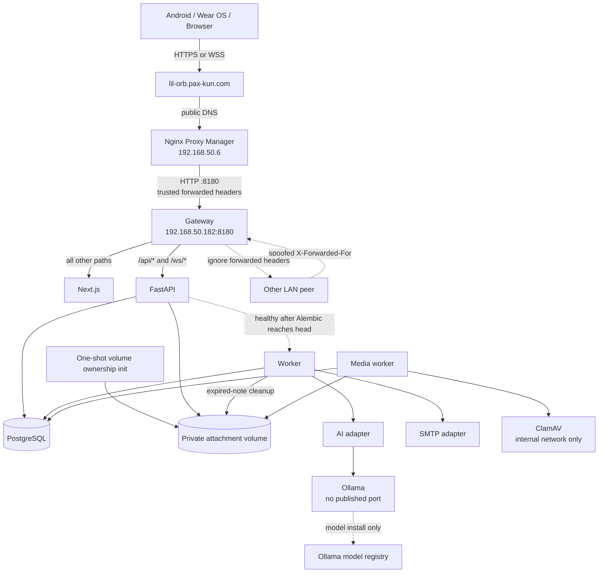
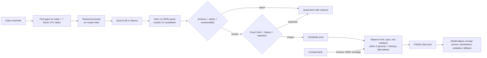
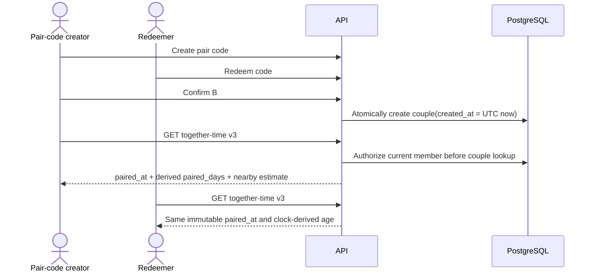
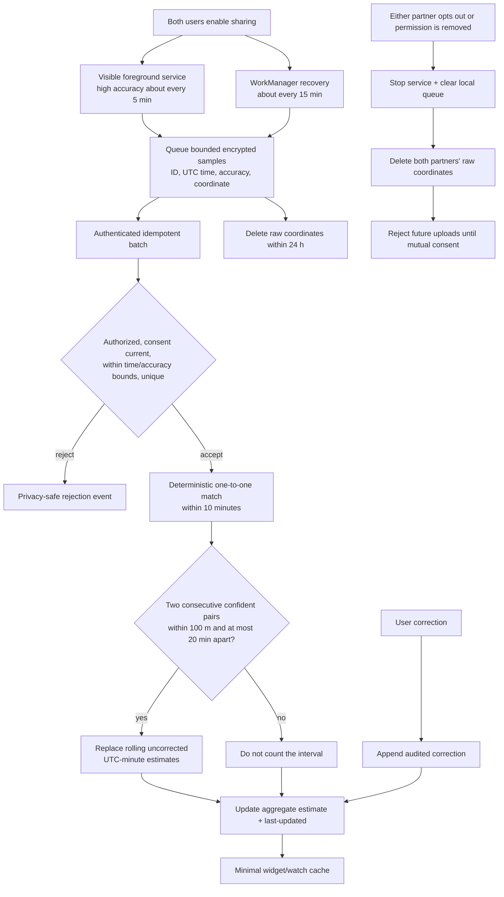
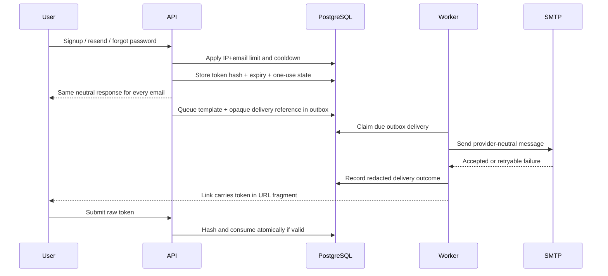
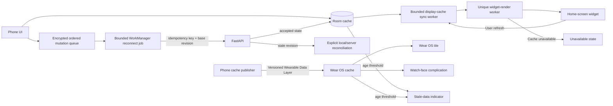
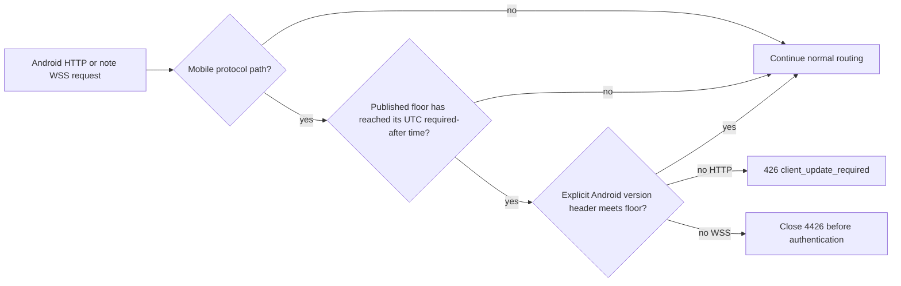

# Network and logic flows

The Mermaid diagrams in this document are the editable architecture source of truth. The overview PNG is a reader-friendly concept and must be regenerated when its flow changes.


## External routing and trust



Only gateway port 8180 is published by Compose. Windows Firewall allows that production port only from `192.168.50.6`. The address `192.168.50.182` needs a DHCP reservation before production use. The worker waits for API health so migrations finish before maintenance or scheduled generation can query the new schema.

Caddy trusts incoming `X-Forwarded-For` only when its immediate peer is `192.168.50.6`. It overwrites a private `X-Little-Orbit-Client-IP` header before proxying to FastAPI. FastAPI validates that value as one IP address and does not enable Uvicorn's generic proxy-header trust.

## Authentication and pairing

```mermaid
sequenceDiagram
    actor A as Creator
    actor B as Partner
    participant API
    participant DB as PostgreSQL
    A->>API: Register + 18+/terms + honeypot
    API->>DB: Store Argon2id hash + hashed verification token
    API-->>A: Neutral response; email verification link
    A->>API: Consume verification token once
    A->>API: Create pair code
    API->>DB: Store hashed 8-char code, expires +10m
    B->>API: Redeem code
    API->>DB: Lock code; verify B and capacity; mark pending
    API-->>A: Ask creator to confirm B
    A->>API: Confirm pending partner
    API->>DB: One transaction: consume code + create two-member couple
    API-->>A: Return shared paired state
    API-->>B: Pairing becomes visible on the next authenticated refresh
```

Public registration, resend, and recovery responses are identical for known and unknown emails. Rate limits apply to IP and normalized email keys.

## Live notes

```mermaid
sequenceDiagram
    participant A as Partner A
    participant API
    participant DB as PostgreSQL
    participant B as Partner B
    A->>API: Open one WSS editor session(note_id)
    API->>DB: Authorize actor before note lookup
    API-->>A: Snapshot(revision N) + unique-account presence
    A->>API: Operation(op_id, base N, insert/delete)
    API->>DB: Lock note; dedupe op_id; transform; append revision N+1
    API-->>A: Ack(op_id, current body, revision N+1)
    API-->>B: Applied operation(revision N+1)
    Note over A,B: Body input debounces 750 ms;<br/>ack patches preserve cursor/selection;<br/>duplicate operation IDs return current state
    A--xAPI: Disconnect
    Note over A: Preserve draft and base revision
    A->>API: Reconnect with base revision
    API-->>A: Operations or conflict snapshot
    Note over A: If revisions diverge beyond safe transform, show both versions
    A->>API: Rename or archive with metadata operation ID
    API->>DB: Lock couple + note; dedupe; increment metadata revision
    Note over DB: Archived notes reject body operations<br/>and remain restorable for 7 days
```

## Private note attachments

```mermaid
sequenceDiagram
    actor A as Current partner
    participant API
    participant DB as PostgreSQL
    participant Files as Private volume
    participant Media as Media worker
    participant AV as ClamAV
    A->>API: Reserve(note_id, op_id, name, type, bytes, SHA-256)
    API->>DB: Authorize before note lookup; lock couple; reserve quota
    API-->>A: Stable attachment ID + exact upload offset
    loop Bounded 1 MiB client chunks
        A->>API: PUT bytes with Upload-Offset
        API->>Files: Append at locked offset
        API-->>A: Current offset and state
    end
    API->>DB: Mark pending_scan only after original SHA-256 matches
    Media->>Files: Stream staged file
    Media->>AV: INSTREAM scan on isolated network
    AV-->>Media: Clean, found, or unavailable
    alt clean and sanitization succeeds
        Media->>Files: Write metadata-free type-specific copy
        Media->>DB: Store sanitized size/hash; mark available
        A->>API: GET sanitized content
        API->>DB: Reauthorize current couple and note
        API-->>A: Private no-store bytes + exact digest
    else scanner unavailable
        Media->>DB: Return to pending_scan for bounded retry
    else unsafe or invalid
        Media->>DB: Mark rejected with content-free reason
        Media->>Files: Delete staged and output bytes
    end
```

The API accepts only the allow-listed media types, at most 100 MiB per file and 2 GiB per current couple. Request streams are bounded before buffering, operation-ID replays must describe the same bytes, and neither staging nor ClamAV has a published port. Android verifies the sanitized hash before preview or **Keep offline**. Deletion removes server bytes immediately; note expiry removes remaining volume objects after the database transaction.

## Daily AI generation



Invalid model output is quarantined rather than repaired. A 180-question curated bank guarantees five general questions plus a consent-gated intimacy alternative for today and seven future dates while the model is unavailable.

## Daily quiz, custom queue, and reveal

```mermaid
sequenceDiagram
    actor A as Partner A
    actor B as Partner B
    participant API
    participant DB as PostgreSQL
    A->>API: GET today's UTC quiz
    API->>DB: Lock couple; snapshot 5 questions once
    Note over DB: Due custom FIFO slots first,<br/>then eligible global questions
    API-->>A: Stable ordered set; no partner answers
    A->>API: PUT private draft(op_id, answer revision)
    API->>DB: Authorize, dedupe op_id, validate type, increment revision
    A->>API: POST finish(day revision)
    API->>DB: Mark A finished; keep reveal closed
    B->>API: Save all five drafts + finish
    API->>DB: Lock both member rows; set one revealed_at timestamp
    API-->>B: Both complete; include both answer sets
    A->>API: Poll content-free status through WorkManager
    API-->>A: revealed=true; no answer content in notification response
    A->>API: GET day
    API-->>A: Side-by-side shared reveal
```

A person may reopen and edit a finished set only before the shared reveal. Past incomplete days remain editable for seven days and remain visible for 30. Custom questions take the next available UTC slot, up to all five questions, and surprise content is hidden from the other partner until its day arrives. Non-surprise custom questions appear in both partners' pending queue. Intimacy-tagged custom or global questions require both partners' current consent. If either person opts out, every unrevealed intimacy prompt is replaced atomically, its drafts are cleared, and both people review the safe replacement before finishing again.

## Pairing-based relationship age



The confirmed pair transaction supplies the only 1.0 relationship-age origin. Android, widget, tile, and complication derive age from that instant and no longer ask either partner to choose a date. Older date-proposal endpoints remain temporarily available for protocol compatibility but RC10 clients do not render or mutate them.

## Together-time processing



Collection may continue into the encrypted local queue while the network is offline. Upload and server processing resume later. Two consecutive confident nearby pairs are still required; RC10 improves the chance of collecting evidence without converting sparse or distant samples into false together-time.

## Smooch delivery and weekly history

```mermaid
sequenceDiagram
    actor A as Sender
    participant PhoneA as Sender phone
    participant API
    participant DB as PostgreSQL
    participant PhoneB as Partner phone
    actor B as Recipient
    A->>PhoneA: Choose one of 9 emoji
    PhoneA->>PhoneA: Queue encrypted send, max 5 / 15 min
    PhoneA->>API: POST emoji + phrase key + operation ID
    API->>DB: Authorize and lock current couple
    API->>DB: Enforce 5 sends in rolling hour; insert once
    API-->>PhoneA: Accepted event + remaining allowance
    PhoneB->>API: Poll pending about every 5 or 15 min
    API-->>PhoneB: Recipient-only pending events
    PhoneB-->>B: Private notification or opted-in full emoji phrase
    PhoneB->>API: Acknowledge delivered event
    B->>API: GET Monday-Sunday weekly history
    API->>DB: Apply couple home timezone; aggregate both directions
    API-->>B: Current and historical weekly totals
```

Smooch rows survive unpairing in each original participant's private archive and never appear to a later partner. Deleting either participant account permanently erases the relationship's Smooch history.

## Email delivery



Email and recovery tokens use URL fragments so browsers do not send them in HTTP request targets or proxy logs. The client submits the token explicitly to the API, where it is hashed and consumed once. Existing query-string links remain accepted during the transition. Local development uses Mailpit. Production uses configured SMTP and never exposes Mailpit publicly. The worker polls the outbox every 30 seconds by default.

## Android offline and wearable cache



Tokens stay in Android Keystore-backed storage. Offline queues contain encrypted countdown mutations, note drafts, location samples, and at most five unexpired Smooch sends. Widget, tile, and complication caches contain only the confirmed pairing instant, coordinate-free nearby seconds and process time, next countdown, and cache-sync time. The separate Wear launcher profile cache contains only display names and server-normalized 128-pixel thumbnails received through the Wearable Data Layer. RC6 publishes the v2 display cache plus the legacy v1 path for one release so an older watch fails stale rather than displaying a new value with the wrong meaning. RC9 coalesces home-widget rendering through WorkManager so cache reads finish under a worker-owned lifecycle; receiver callbacks only enqueue bounded work.

## Profile photo processing and synchronization

```mermaid
sequenceDiagram
    actor Owner
    participant Phone
    participant API
    participant DB as PostgreSQL
    participant Partner as Partner phone
    participant Watch as Wear launcher
    Owner->>Phone: Choose image and approve square crop
    Phone->>API: PUT authenticated image, max 5 MiB
    API->>API: Decode, orient, strip metadata, crop and bound WebP variants
    API->>DB: Lock owner; atomically replace image and revision
    API-->>Phone: Private revision and content hash
    Partner->>API: Authorize current pairing before partner image lookup
    API-->>Partner: 128 px WebP with private ETag
    Partner->>Partner: Encrypt thumbnail in app-private storage
    Partner->>Watch: Authorized names and thumbnails over Wearable Data Layer
    Watch->>Watch: Replace app-private launcher cache
    Note over Phone,Watch: Widget, tile, and complication remain text-only
    Owner->>API: DELETE photo or account
    API->>DB: Delete image; current-partner access ends
```

An unpaired caller never reaches the partner photo lookup. Photo replacement and deletion lock the owning account so concurrent first uploads cannot race. Clients compare both revision and content hash, which prevents a deleted then re-added revision from preserving stale bytes.

## Self-hosted Wear installation

```mermaid
sequenceDiagram
    actor Person
    participant Phone as Little Orbit phone app
    participant API as Public release API
    participant Watch as Wear OS wireless ADB
    Person->>Phone: More > Install on watch
    Phone->>API: Fetch current immutable release metadata
    Phone->>API: Download exact versioned Wear APK
    Phone->>Phone: Verify endpoint, bytes, hash, package, version, watch feature, signer
    Phone->>Phone: Track pairing/connect services and port changes with local DNS-SD
    Person->>Phone: Enter the watch's short-lived pairing code
    Phone->>Watch: Pair with reusable phone identity
    Phone->>Watch: Prove authorization with a bounded echo command
    Phone->>Watch: Read watch characteristic, SDK, installed version, security patch
    alt patch before 2026-05-01 or unknown
        Phone-->>Person: Warn; cancel or explicitly install anyway
    end
    Phone->>Watch: Create package session; write verified APK; commit with -r
    Watch-->>Person: Little Orbit app, tile, and complication available
```

The phone checks connected nodes and the `little_orbit_display_v2` capability so More can distinguish no watch, a missing watch app, and a connected Little Orbit watch. The installer starts only after a person opens it, supports manual addresses when discovery permission is denied, refuses non-watch devices and downgrades, and stores the ADB private key encrypted by Android Keystore. API 34+ discovery callbacks replace and remove service information continuously; older releases serialize one-shot resolution. The public website deep-links `/app/install-wear` into this flow and retains a raw Wear APK link for advanced recovery.

## Patch notes and RSS

```mermaid
flowchart LR
    Build[Signed per-module release manifest] --> Publish[Publish immutable APK record]
    Publish --> DB[(PostgreSQL)]
    DB --> History[GET /api/v1/releases/history]
    History --> Notes[/patch-notes]
    History --> RSS[/patch-notes.xml RSS 2.0]
    Fallback[Checked-in latest signed fallback] --> Notes
    Fallback --> RSS
```

Release history contains only public version, checksum, minimum Android, mirror URL, notes, and publication time. Both pages use the checked-in signed-release fallback during an API outage.

## Verified Android phone updates

```mermaid
sequenceDiagram
    actor Person
    participant Phone as Little Orbit phone app
    participant API as Public release API
    participant Files as Read-only release directory
    participant DM as Android DownloadManager
    participant PI as Android PackageInstaller
    Phone->>Phone: First RC10 launch asks whether detection is enabled
    Phone->>API: Enabled or required: metadata check about every 6 h
    API-->>Phone: Immutable version, URLs, size, hashes, floor, optional UTC enforcement
    Phone->>Phone: Validate trusted API path, package, pinned signer, and update policy
    alt optional release
        Phone-->>Person: Prompt once this process; persistent More banner
    else active compatibility floor excludes installed version
        Phone-->>Person: Update required or exit
    end
    Person->>Phone: Update now
    Phone->>DM: Enqueue versioned Little Orbit API URL
    DM->>API: GET APK, optionally with Range
    API->>Files: Verify exact size and SHA-256
    Files-->>API: Signed immutable APK
    API-->>DM: 200 or 206 with exact length and resume headers
    DM-->>Phone: Android-owned progress / completion
    Phone->>Phone: Verify exact size + SHA-256 + package + newer version + certificate
    alt any verification fails
        Phone->>Phone: Delete APK and offer a clean retry
    else all properties match
        Phone->>PI: Create install session with verified bytes
        PI-->>Person: Android installation approval
        Person->>PI: Approve or cancel
        PI-->>Phone: Installed or retry-safe result
    end
```

The periodic worker fetches metadata only. It cannot download or install an APK. Optional discovery follows the person's opt-in; an active required floor bypasses that preference. Updater state contains the opt-in, last-check time, release ID, phase, byte counts, required flag, and sanitized failure code; it contains no credentials or relationship data. A running or paused transfer with no progress for five minutes becomes a retryable stalled state. Published release records cannot be edited or unpublished.



The compatibility gate runs before authentication and protected resource lookup, so its response cannot disclose account or relationship state. Routine publications leave `required_after` empty and remain optional.
